# CSME2 Bonus point Assignments

Revised submission of the bonus point assignments in the course Computer Science in Mechanical Engineering II (CSME2) by Prof. Trimpe.

## Requirements
Make a new environment in anaconda or miniconda and install the following packages.

For Assignment I:  
`conda install -y pandas seaborn scikit-learn pytorch torchvision cpuonly -c pytorch`

For Assignment II:  
`conda install -y pandas seaborn scikit-learn gym pytorch torchvision cpuonly -c pytorch`

## Bonus point Assignment I - Neural Networks

People, who are interested, can preprocess these datasets to it to the Jupyter Notebooks. 

- **Dataset Part A**: [Y. LeCun and C. Cortes, “The MNIST database of handwritten digits,” 2005.](http://yann.lecun.com/exdb/mnist/)
- **Dataset Part B**: [Energy and Weather Data from Spain](https://www.kaggle.com/datasets/nicholasjhana/energy-consumption-generation-prices-and-weather?select=weather_features.csv)

### Plots

#### Part A

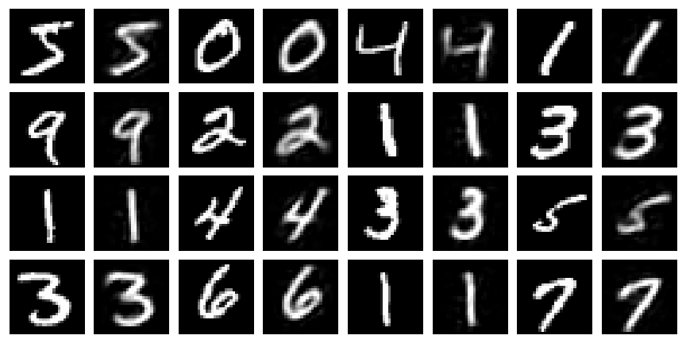  
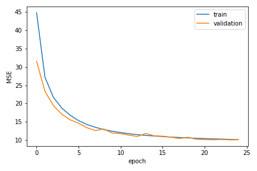  
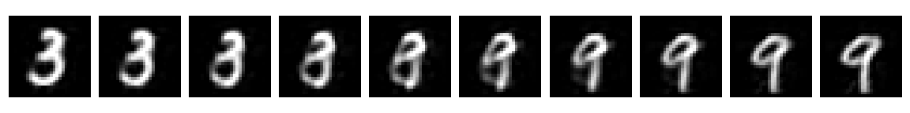  
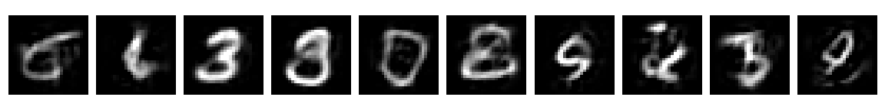 

#### Part B
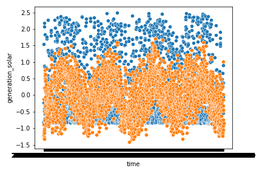 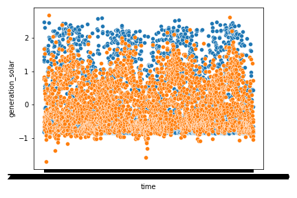  
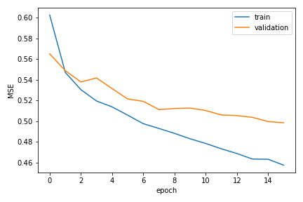 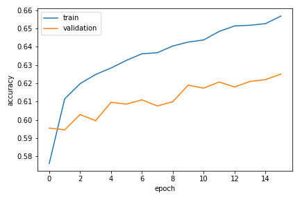 

## Bonus point Assignment II - Q-Tables, Policy Gradients, Deep Q-Network

### Plots

#### Part A

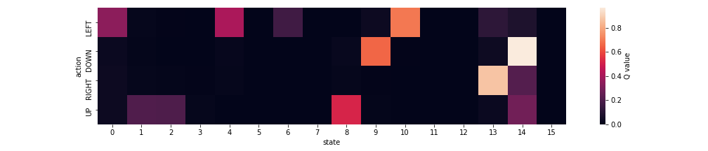  
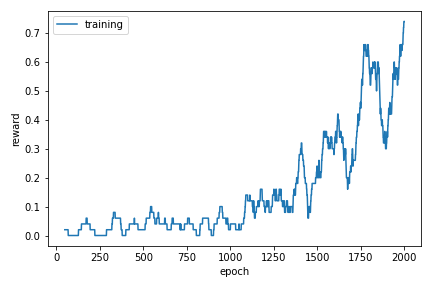  
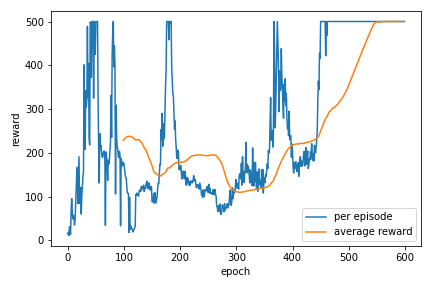  

## TODOs

- [ ] training of DQN network
- [ ] validation of both networks
- [ ] task description

# Authors
Marcel Golle-Leidreiter  
Tabea Scherling  
Sven Tschamper